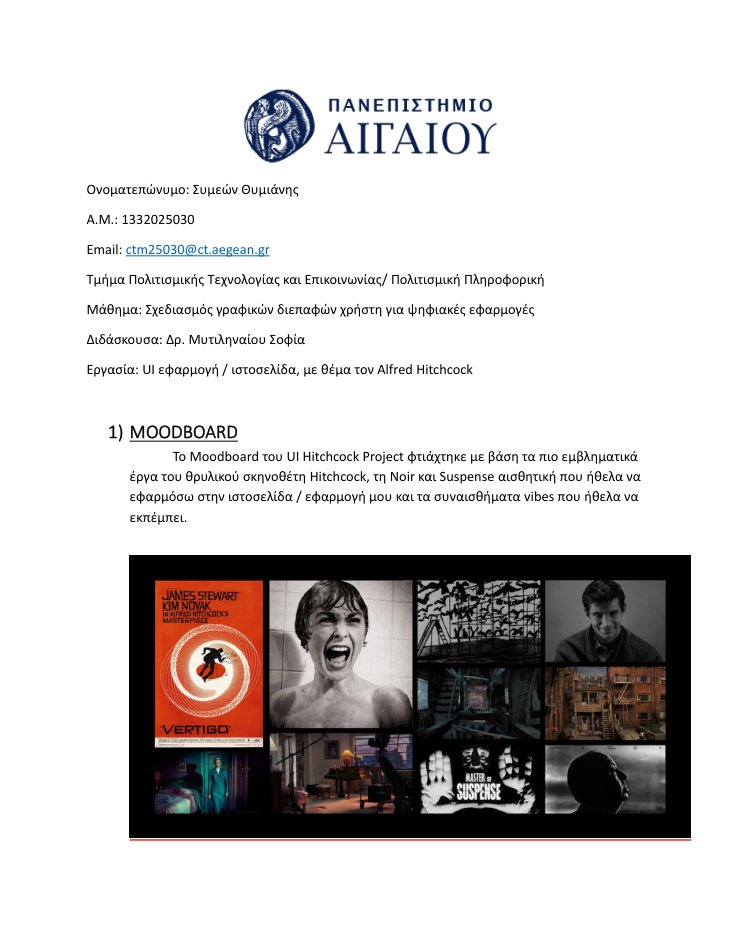
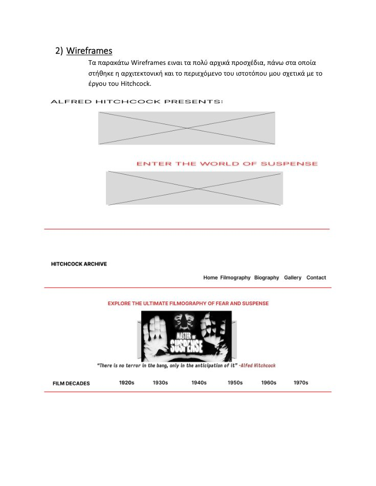
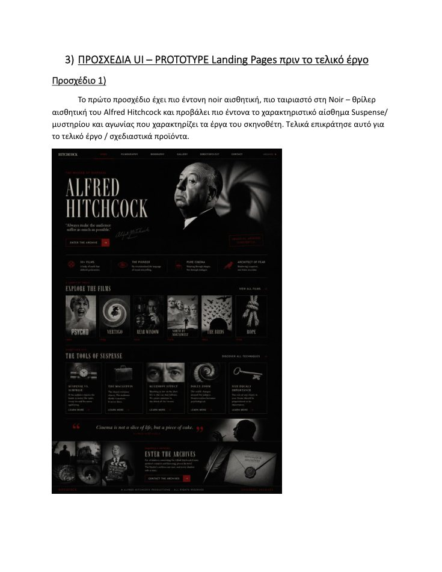
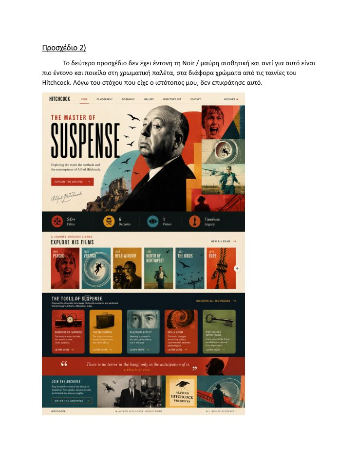
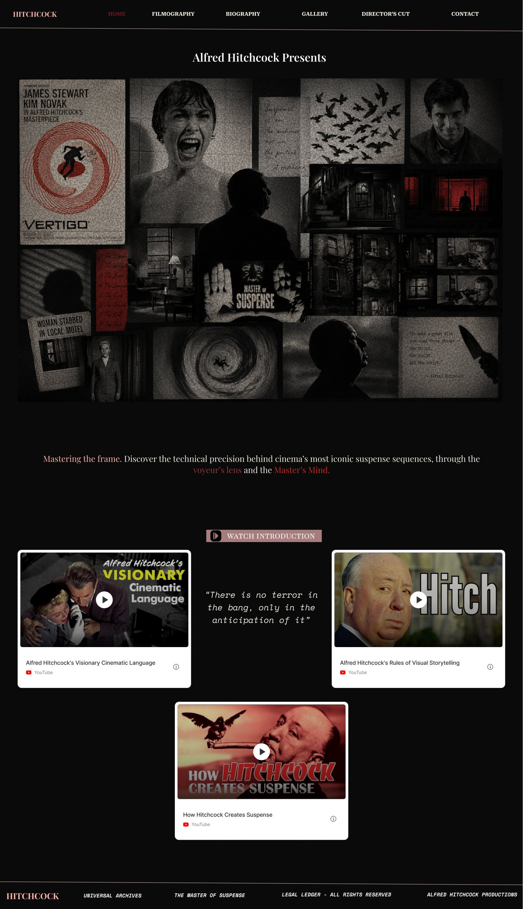
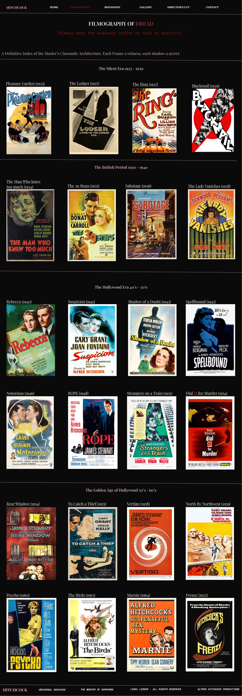
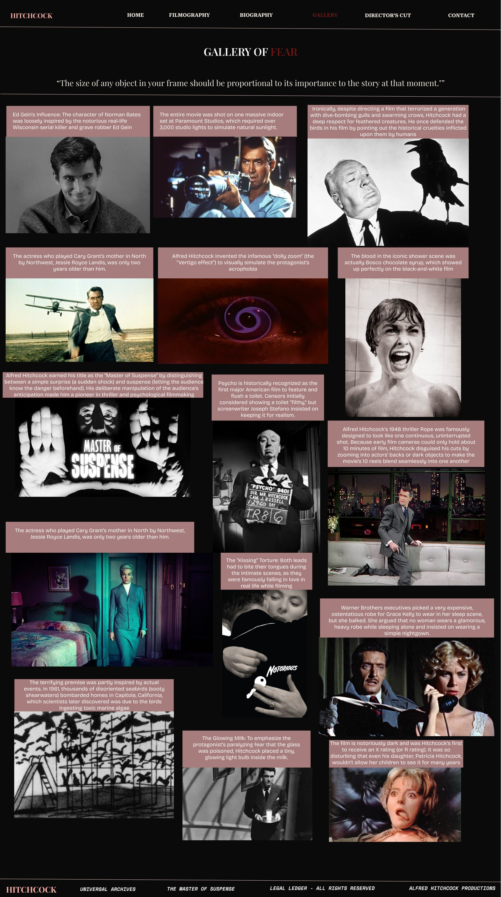
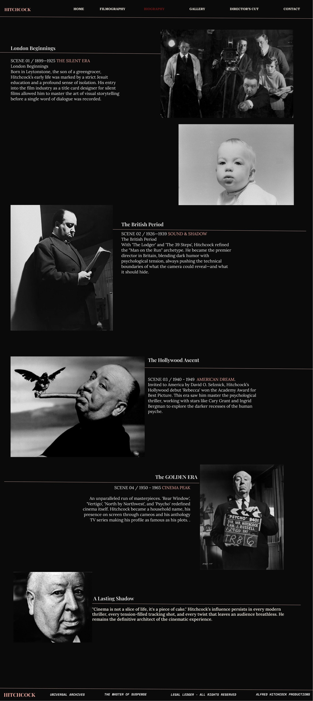
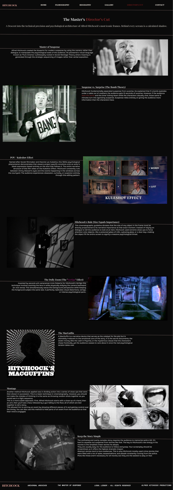
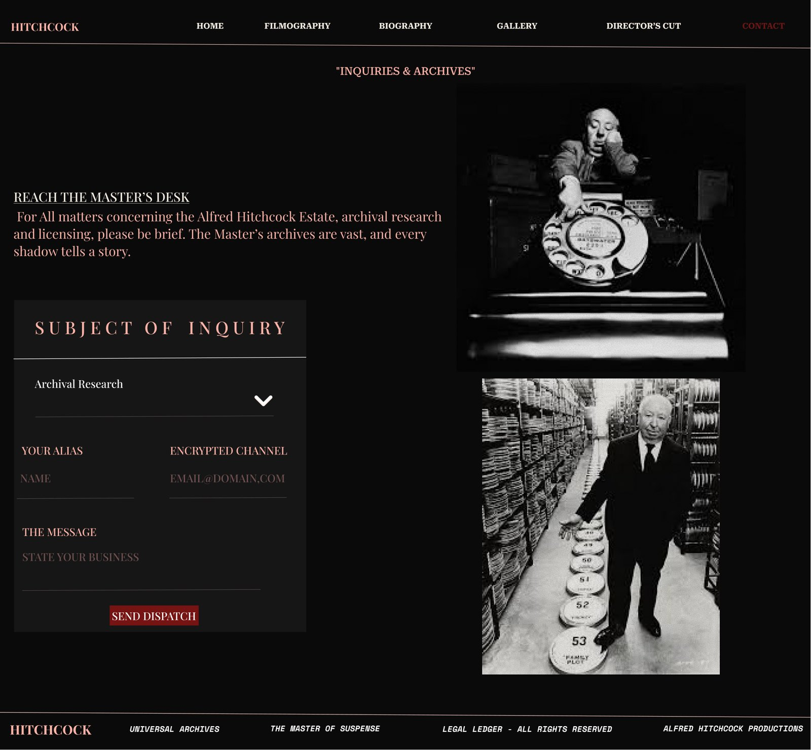

# Alfred Hitchcock Digital Archive - UX/UI Case Study

**Figma · UX Research · UI Design · Wireframing · Prototyping · Information Architecture**

A UX/UI case study for a cinematic digital archive centered on Alfred Hitchcock's life, filmography, visual language and legacy. The project combines user research, competitor analysis and interface design to explore how a cultural/film archive can balance atmospheric presentation with clear navigation and deeper editorial content.

## Interactive Prototype

[View the interactive Figma prototype](https://www.figma.com/proto/vUNjqifmDAcO7Wh1F3JoR2/Alfred-Hitchcock?node-id=63-2&p=f&t=BzAd8gXsG6YILHFs-1&scaling=min-zoom&content-scaling=fixed&page-id=0%3A1)

## Overview

The project began with UX research into existing Hitchcock-related websites and archives. The research highlighted a recurring trade-off: visually polished official experiences were easy to navigate but relatively shallow in content, while research-oriented archives offered greater depth but often used dated or dense interfaces.

The design response was a multi-page archive experience that combines:

- a strong noir/suspense visual identity,
- clear top-level navigation,
- structured filmography and biography content,
- editorial sections for film analysis and visual storytelling,
- gallery-based discovery,
- a dedicated contact/archive inquiry experience.

## UX Process

### 1. Competitive Analysis

The research compared multiple Hitchcock-related digital experiences, including the official site and archive-oriented alternatives. Key criteria included:

- target users and context of use,
- navigation and information architecture,
- content depth,
- usability,
- visual consistency,
- trust and credibility,
- interaction and feedback.

A major insight was that the strongest opportunity was not simply to make another promotional site, but to combine **accessible navigation with richer film-focused content**.

### 2. User Research

A small qualitative study was conducted with **three participants** representing different levels of technology familiarity and knowledge of cinema.

Participants were asked to:

- find information about Hitchcock's life,
- locate films,
- understand the purpose of the site,
- explore the available content,
- navigate freely according to their own interests.

### 3. Key Findings

Positive observations from the reference experience included:

- easy navigation,
- clear first impression,
- attractive cinematic visual language,
- low barrier to use for less experienced users.

Recurring issues included:

- limited depth for users seeking serious film research,
- insufficient information about individual films,
- low engagement beyond the first visit,
- some ambiguity between informational and promotional intent.

These findings informed the direction of the final interface: a visually cinematic archive with more explicit content structure and multiple ways to explore Hitchcock's work.

## Design Process

### Moodboard



The visual direction was built around Hitchcock's noir, suspense and psychological-thriller identity.

### Wireframing



Early wireframes established the information hierarchy, page structure and content architecture before high-fidelity UI work.

### Exploring Two Visual Directions

**Noir direction - selected**



The darker direction was selected because it aligned more strongly with suspense, mystery and the cinematic identity of the subject.

**Alternative color direction**



A brighter, more colorful alternative was explored using palettes inspired by Hitchcock film posters, but was not selected for the final product.

## Final Interface

### Home



### Filmography



### Gallery of Fear



### Biography



### Director's Cut



### Contact / Archive Inquiry



## Information Architecture

The final prototype is organized around six primary sections:

1. **Home** - visual introduction and selected video/editorial content.
2. **Filmography** - chronological exploration of Hitchcock's films.
3. **Biography** - timeline-based presentation of major career periods.
4. **Gallery** - visual discovery and film-related facts.
5. **Director's Cut** - deeper editorial content about suspense, montage, POV, the Kuleshov effect, the dolly zoom and the MacGuffin.
6. **Contact** - archive/research inquiry interface.

## Visual System

### Typography

- **Playfair Display** - primary headings and editorial titles.
- **Space Mono** - quotes, highlights and archive-like annotations.
- **Bricolage Grotesque** - longer analytical and gallery text.
- **Lora** - references, credits and bibliography-oriented content.

### Color Direction

The interface uses:

- near-black / black backgrounds,
- white and off-white primary text,
- burgundy / dark red accents,
- dusty rose and muted pink supporting tones,
- pale beige / vintage highlights.

The goal is to create a noir editorial identity while retaining readable hierarchy across dense cultural content.

## What This Project Demonstrates

- UX research and qualitative user interviews.
- Competitive analysis and synthesis of findings.
- Translating research findings into interface decisions.
- Information architecture for content-rich digital products.
- Low-fidelity wireframing and high-fidelity UI design.
- Visual direction exploration and design rationale.
- Typography and color-system definition.
- Multi-page prototyping in Figma.
- Cultural and editorial digital-product design.

## Next Improvements

If developed further, I would:

- conduct usability testing directly on the redesigned prototype,
- create responsive/mobile layouts,
- formalize reusable Figma components and design tokens,
- strengthen accessibility and contrast checks,
- add clearer interaction states and micro-interactions,
- refine content hierarchy for research-oriented users,
- perform a final editorial/fact-check pass on all archive content.

## Repository Structure

```text
Hitchcock-UX-UI/
├── README.md
├── CREDITS.md
├── Screenshots/
│   ├── Final/
│   │   ├── 01-home.jpg
│   │   ├── 02-filmography.jpg
│   │   ├── 03-gallery.jpg
│   │   ├── 04-biography.jpg
│   │   ├── 05-directors-cut.jpg
│   │   └── 06-contact.jpg
│   └── Process/
│       ├── 01-moodboard.jpg
│       ├── 02-wireframes.jpg
│       ├── 03-noir-direction.jpg
│       └── 04-alternative-direction.jpg
└── Documentation/
    ├── UX_Research_Summary.md
    ├── Design_Process.md
    └── Design_System.md
```

## Project Scope

This is an academic, non-commercial UX/UI concept and portfolio case study. It is not an official Alfred Hitchcock website and is not affiliated with the Alfred Hitchcock estate, Universal, or other rights holders.
